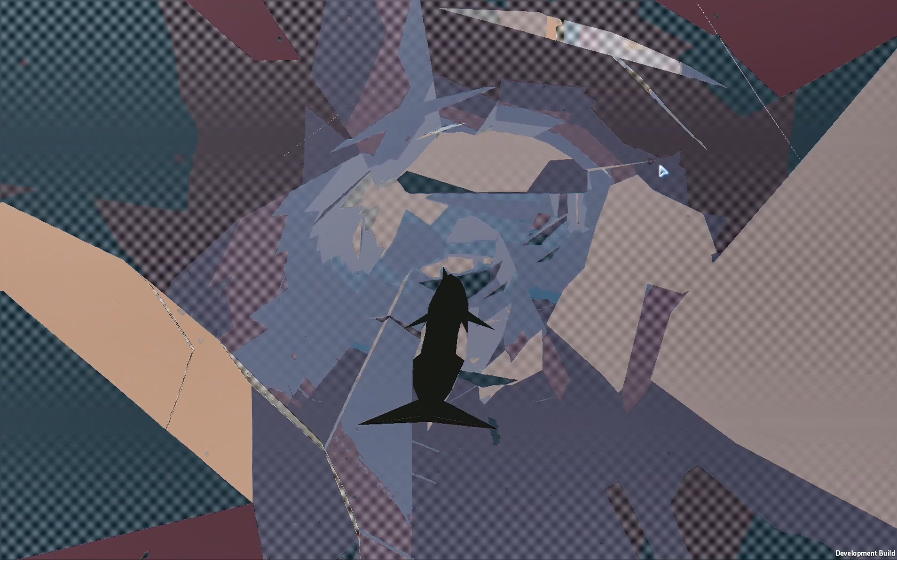
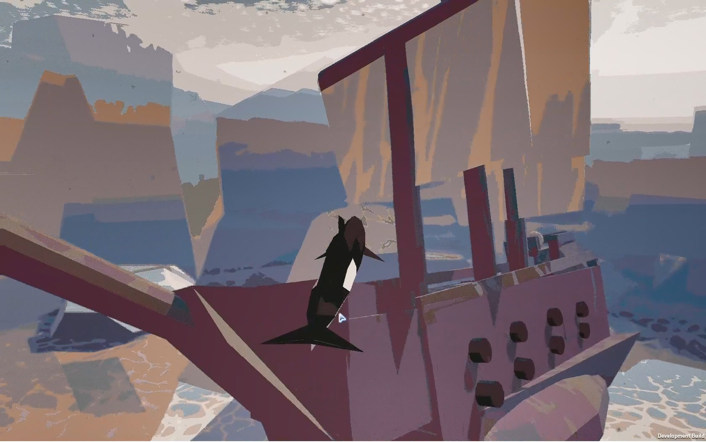
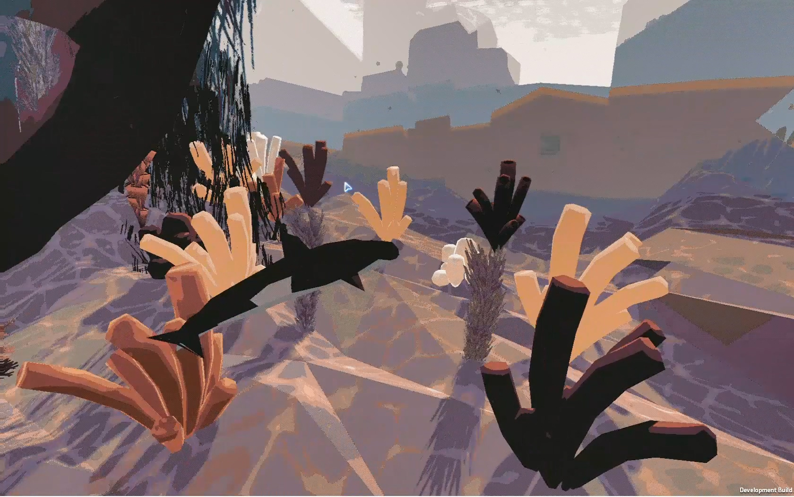
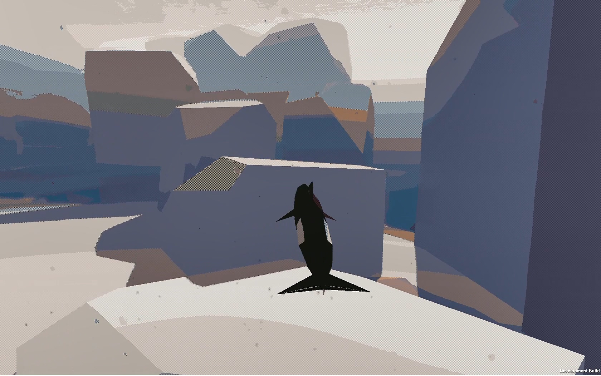
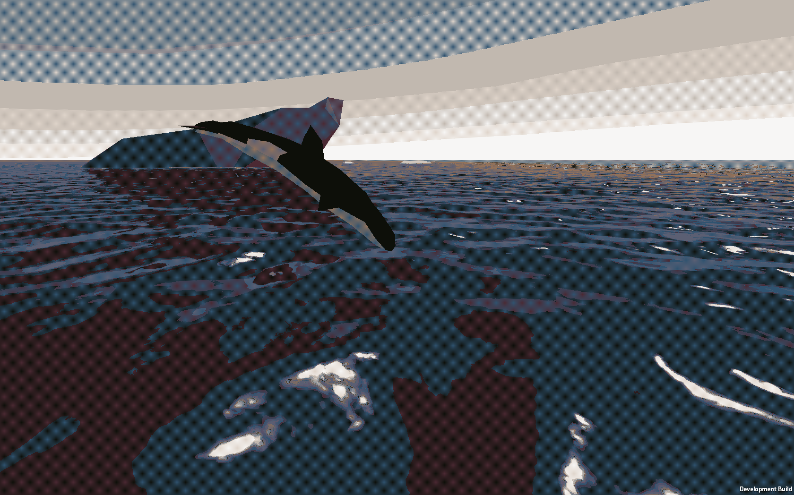
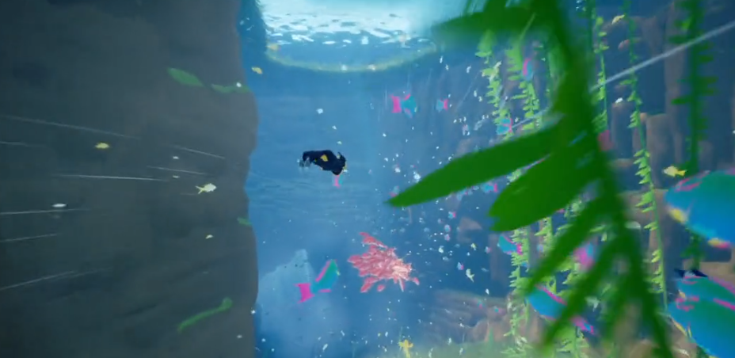
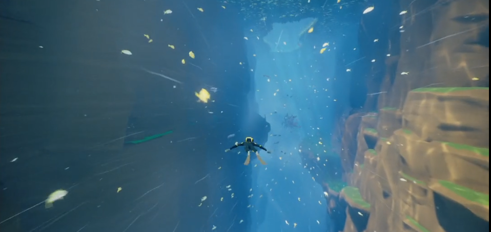

## Development Summary

三个世界，生成or固定世界。

### Objects & Scripts

#### Global

- Camera

  第三人称跟随，速度越大FOV越大。`MianCamera.cs`

- Main Character : Alice

  主镜头跟随对象，鲸鱼or妹子。`MoveEvent.cs`

  随着运动方向改变自身朝向。 `UpdateDirection.cs`

  碰撞（减速/伤害/收集品）。`ColliderEvent.cs`

- 游动边界

  只要碰到边上直接给予加速度。`BoarderEvnet.cs`

- Others

  ~~杂鱼，在视野范围内生成随机pattern的鱼类群组，可调参。`Env_GenerateMisc.cs`~~
  
  > 一种爆炸卡的解决方案：[直接Instance](https://gitee.com/lipengfeikk041kk/YuQunSuanFa/blob/master/YuQunSuanFa/Assets/Script/Yu.cs)，DEPRECATED

- SkyBall

  Simple Cloud Picture

#### Area

1. 峡谷

   该区域单一线路，两边是岩石强，上方为水面，下方无(隐去)。

   - (Damage) 虎鲸

     后方寻路追击，距离越远速度越快。

   - (Obstacles) 漂浮物

     随机速度从海面降落，Alice碰撞后减速/*撞击动画*。`CollitionEnent,cs`

   - (Obstacles) 岩石

     生成/放置岩石块，效果同上。

   - (Terrain) 左右岩石壁

2. 珊瑚

   无边界世界，珊瑚枯萎以提供方向，实际上还是一个大Collider追Alice的场景。

   - (Damage) 污水

     体积光？提供触发事件给珊瑚，使其变色枯萎(Animation)。

   - (Obstacle) 巨大珊瑚

     随机生成

   - (Terrain) 珊瑚

     触发事件使其变化，享元在广场景放置。

3. 冰川

   视野在冰面以下仰视，含**冰层破裂**，模糊影子。远处有光点以提供方向。无直接追击伤害。

   - (Obstacle) 船

     碰撞后有鱼叉直接刺下来。

   - (Obstacle) 炸弹

     冰面阴影提示，会破洞然后有炸弹<u>沉下</u>。VFX.震荡波。

   - (Terrain) 冰层

     挺厚的一层方便实现，船经过的地方会使冰层裂开（How To Code!? ）。

4. Misc

### Preview

### Style Foward

### Style Extensions

- stylizer

  极简风格（低采样）+像素化

- Low Poly

